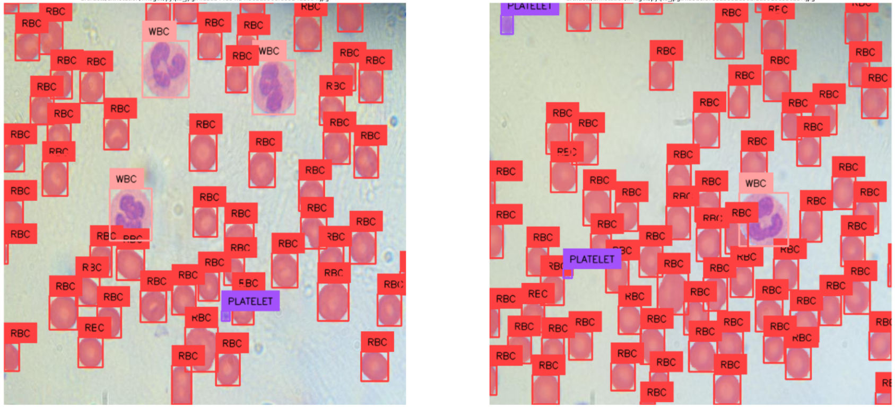

# <div align='center'>Image Segmentation Using YOLOv8 And SAM</div>

This project provides an implementation of image segmentation using YOLOv8, a state-of-the-art object detection algorithm, coupled with Spatial Attention Module (SAM) for enhanced segmentation accuracy. Leveraging the power of YOLOv8's object detection capabilities and SAM's attention mechanism, this project offers efficient and precise segmentation of images. 


## Examples




## Dataset

* Here, I have used [this](https://universe.roboflow.com/motherson-hmdiff/tej_priid_2) blood cells dataset. You can use your own dataset.


## <div style="padding-top: 20px"> Steps to run </div>

<div style="padding-bottom:10px"><b>STEP 00 :</b> Clone the repository</div>

```bash
https://github.com/utpalpaul108/Image-Segmentation-Using-YOLOv8-and-SAM
```
<div style="padding-top:10px"><b>STEP 01 :</b> Create a virtial environment after opening the repository</div>

Using Anaconda Virtual Environments

```bash
conda create -n venv python=3.10 -y
conda activate venv
```
Or for Linux operating system, you can use that

```bash
python3.10 -m venv venv
source venv/bin/activate
```

<div style="padding-top:10px; padding-bottom:10px"><b>STEP 02 :</b> Install the requirements</div>

```bash
pip install -r requirements.txt
```

Finally, run the following command to run your application:
```bash
python app.py
```

<div style="padding-top:10px"><b>STEP 03 :</b> Run the application</div>

Now,open up your local host with a port like that on your web browser.
```bash
http://localhost:8080
```
<div style="padding-top:10px"><b>STEP 04 :</b> Train the model</div>

You can train your model with your own dataset.
```bash
http://localhost:8080/train
```
After completing the training, you can now upload any blood cells image and detect the blood cells.


